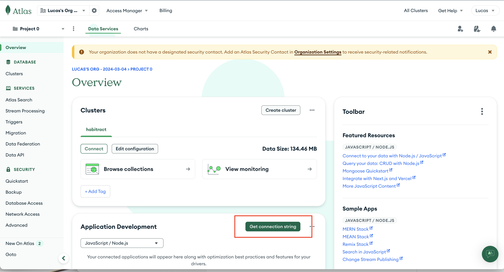

Install the packages for the database backend:
```
npm install package.json
```

Go grab your connection string from this location:



Then create a config.env file:

```
cd database
touch config.env
```

And add in the ALTAS_URI environment variable into the string, as well as the port number:

```
ALTAS_URI=<your-connection-string>
PORT=5050
```

Run the database:
```
node --env-file=config.env server
```
